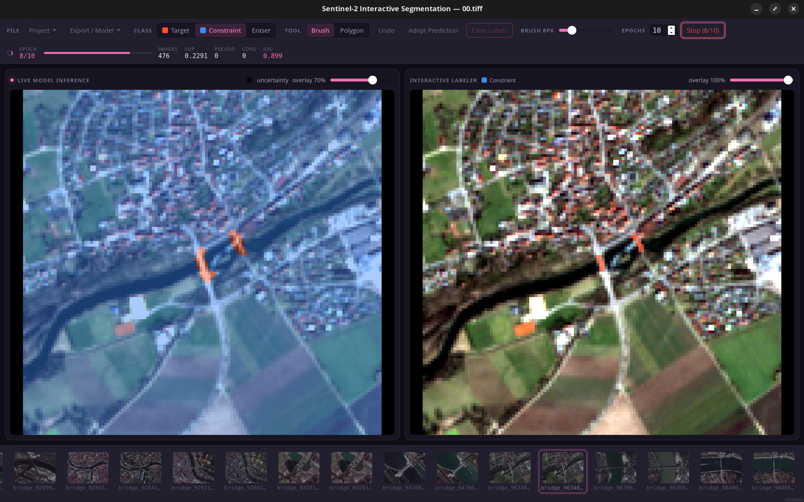

# Kaio-ken Segmenter  

## A label tool for Remote Sensing, supports GeoTiffs with more than just 3 Bands! 


## Disclaimer

This is a prototype for human-in-the-loop (binary) semantic segmentation in
remote sensing with semi-supervised training.
I build this after some exciting talks in a conference. **I also used
AI code generation in this project to get started.**

The tool turned out to be very useful to my work in remote sensing, and I
hope it is useful for others too.
**At the current state I can't guarantee that it works on every machine!**


Workflow: paint ground-truth strokes on the right pane, click
**Train**, and watch the live model inference refresh on the left pane.
Iterate until the prediction is good, then export the model (`.pth`/`.onnx`),
a standalone executable, or the merged mask.

## Install & run

Install straight from the release — no download step:

```bash
python3 -m venv .venv
# CPU-only torch (no CUDA download); drop the extra index on a GPU machine
.venv/bin/pip install --extra-index-url https://download.pytorch.org/whl/cpu \
    https://github.com/raphi-web/kaioken_segmenter/releases/download/v0.1.0/kaioken_segmenter-0.1.0-py3-none-any.whl
.venv/bin/python -m kaioken start [path/to/image.tiff | path/to/project_dir]
```

Newer versions are on the
[releases page](https://github.com/raphi-web/kaioken_segmenter/releases); swap
the version in the URL, or download the `.whl` and pass its path instead.

`pywebview` renders through GTK/WebKit2 when the system has it
(`PyGObject` + `gir1.2-webkit2-4.1`). If it does not, install the bundled Qt
renderer instead — note the quotes, which shells need around the brackets:

```bash
.venv/bin/pip install "kaioken-segmenter[qt] @ https://github.com/raphi-web/kaioken_segmenter/releases/download/v0.1.0/kaioken_segmenter-0.1.0-py3-none-any.whl"
```

The same form adds `[export]` for "Export Executable", or `[qt,export]` for both.

### Commands

```bash
python3 -m kaioken start [PATH]                     # open the labelling app
python3 -m kaioken fetch-assets                     # download the optional model assets
python3 -m kaioken predict -m model.onnx IMG.tif    # run an exported model, no GUI
python3 -m kaioken paths                            # show where assets are being looked for
```

`kaioken` works as a bare command too, e.g. `kaioken start`.

`predict` runs a model **you exported** ("Export ONNX"), not the pretrained
weights — so it always needs one. `-m/--model` defaults to `model.onnx` in the
current directory, which is only convenient inside an exported folder; anywhere
else, pass the path. It writes `IMG_prediction.tif` next to the input unless
`-o` says otherwise; `python3 -m kaioken predict --help` lists band mapping,
nodata and probability-raster options.

### Optional assets

The wheel is ~170 KB and carries no model weights — the SAM2 encoder alone is
109 MB. Both extras are downloaded on demand into a per-user cache
(`~/.cache/kaioken` on Linux) and both are genuinely optional:

```bash
python3 -m kaioken fetch-assets --weights   # 23 MB, pretrained initialization
python3 -m kaioken fetch-assets --sam2      # 126 MB, click-assist
```

Without the weights a model simply trains from scratch; without SAM2 the
click-assist button stays disabled. Point at your own copies with
`KAIOKEN_WEIGHTS` / `KAIOKEN_SAM2_DIR` instead, if you have them.

### Export Executable

"Export Executable" packages the standalone predictor with PyInstaller so a
colleague can run your model without Python. It builds on demand and takes a
few minutes, so it needs the export extra:

```bash
pip install "kaioken-segmenter[export]"
```

Without it the button stays disabled and says so. The result is a ~300 MB
folder holding the `predictor` binary and your model as `model.onnx`; the
binary opens a window when double-clicked and takes CLI flags otherwise
(`predictor --help`).

## Development

```bash
git clone https://github.com/raphi-web/kaioken_segmenter.git
cd kaioken_segmenter
python3 -m venv venv
venv/bin/pip install --extra-index-url https://download.pytorch.org/whl/cpu -e ".[dev,qt]"
cd frontend && npm install && npm run build && cd ..
venv/bin/python -m kaioken start          # defaults to 00.tiff
venv/bin/python -m pytest
```

Run from a checkout and the asset lookups fall back to the repo's own
`pretraining/`, `sam2/onnx/` and `frontend/dist/`, so nothing needs downloading.

## Building the wheel

### Prerequisites

- **Python 3.10+** with the `build` package (`pip install build`, or `-e ".[dev]"`).
- **Node.js / npm** — on the *build* machine only. The React UI is compiled here
  and bundled into the wheel, so nobody installing it ever needs Node.

### Build

```bash
python3 -m build
```

That is the whole thing. It writes two files to `dist/`:

| File                                       | Size    | What it is            |
| ------------------------------------------ | ------- | --------------------- |
| `kaioken_segmenter-0.1.0-py3-none-any.whl` | ~170 KB | the installable wheel |
| `kaioken_segmenter-0.1.0.tar.gz`           | ~140 KB | source distribution   |

The wheel is `py3-none-any` — pure Python, so one build works on every platform
and Python 3.10+.

Under the hood `hatch_build.py` runs `npm ci && npm run build` in `frontend/` and
copies the result into `src/kaioken/_frontend/`, which ships as package data. If
that copy ends up empty the build **fails** rather than producing a wheel with no
UI. To reuse a frontend you already built (CI, or no network):

```bash
cd frontend && npm run build && cd ..
KAIOKEN_SKIP_FRONTEND_BUILD=1 python3 -m build --wheel
```

### Check what you built

The wheel should carry the UI and **no** model assets — those are downloaded at
runtime, and a stray `.pth` or `.onnx` would mean a ~450 MB wheel:

```bash
unzip -l dist/*.whl | grep _frontend            # expect index.html + assets/
unzip -l dist/*.whl | grep -E '\.pth|\.onnx$'   # expect no matches
```

### Install it

On the target machine, in a fresh venv:

```bash
python3 -m venv .venv
# CPU-only torch (~200 MB); drop the extra index on a GPU machine to get CUDA
.venv/bin/pip install --extra-index-url https://download.pytorch.org/whl/cpu \
    dist/kaioken_segmenter-0.1.0-py3-none-any.whl
.venv/bin/python -m kaioken start
```

Add extras in the usual way — `"...whl[export]"` for the PyInstaller-backed
"Export Executable", `[qt]` if the system has no GTK/WebKit2.

Then confirm the install found everything:

```bash
.venv/bin/python -m kaioken paths
```

Run this from **outside** the repo. It should print `source tree : (installed,
not a checkout)` and point the frontend at `site-packages/kaioken/_frontend/`.
If it names the repo instead, you are running the checkout, not the wheel.

### Releasing

1. Bump `__version__` in `src/kaioken/__init__.py` — `pyproject.toml` reads the
   version from there, so that is the only place to change it.
2. `rm -rf dist/ && python3 -m build`
3. Attach the `.whl` (and `.tar.gz` if you want) to a GitHub release.

The model assets are versioned separately, under the `assets-v1` tag, because
weights change far less often than code — see `ASSET_RELEASE` in
`src/kaioken/assets.py`. Re-uploading 130 MB for a patch release is not needed;
only publish new assets when the weights themselves change, and bump that tag in
both places when you do.

### Troubleshooting

| Symptom                                         | Cause                                                                                                                           |
| ----------------------------------------------- | ------------------------------------------------------------------------------------------------------------------------------- |
| `npm not found on PATH`                         | Node missing. Install it, or prebuild `frontend/dist` and set `KAIOKEN_SKIP_FRONTEND_BUILD=1`.                                  |
| `frontend build produced no .../index.html`     | The Vite build failed — scroll up for its error.                                                                                |
| `paths` names the repo after installing a wheel | The venv is inside the checkout *and* you are running from `src/`. Check `python -c "import kaioken; print(kaioken.__file__)"`. |
| Torch pulls gigabytes                           | The CUDA build is the default. Add `--extra-index-url https://download.pytorch.org/whl/cpu`.                                    |

## How it works
### 1. Data & Classes

- Target (0): Orange.
- Background (1): Blue.
- Unlabeled (255): Ignored during training; treated as "nodata."
- Preprocessing: Per-band 2nd–98th percentile scaling to [0, 1] range, ignoring nodata.

### 2. Model Architecture

- Core: encoder/decoder net trained from scratch — residual depthwise-separable
  CNN encoder, a decoder with skip connections and channel attention, and a
  selectable bottleneck at 1/16 scale (project setting `data_profile.bottleneck`):
  - `conv` (default): plain conv block, 64 base channels, ~3.0M params. Measured
    better on 10 m/px imagery — mean best IoU 0.535 vs 0.428 over 3 seeds — at
    half the size.
  - `transformer`: pre-norm transformer block, 44 base channels, ~5.7M params.
    Kept for higher-resolution imagery, where features at the scale attention
    exploits are more likely to exist.
- Input: Raw bands, processed in 96×96 patches (default; any multiple of 16).
- Output: One logit per class per pixel; softmax gives the class probabilities.
- Inference: Uses overlapping tiles with logit averaging for smooth, full-image results.
- Sharpening: Optional PointRend head for cleaner boundaries on uncertain pixels.

### 3. Training Strategy

- Supervised: Cross-entropy + Dice on user-labeled pixels (user input overrides model).
- Semi-supervised: FixMatch-style pseudo-labeling on confident (>0.9) predictions.
- Consistency: MSE between weak/strong augmentations.
- Gating: the unsupervised terms stay off until the model holds a target IoU of
  0.55 for 3 consecutive epochs, then fade in over 60% of the epochs that remain.

### 4. SAM2 Assist

- Efficient-SAM2 exported to ONNX.
- Runs via onnxruntime: no GPU or heavy PyTorch dependencies required for click-to-segment.

### 5. Exports

- Model/State Dict: Saves training weights.
- ONNX/Executable: Standalone predictor reproducing app inference (tiling, scaling, thresholding).
- Mask: 1-band uint8 GeoTIFF (prediction + user labels) with original CRS/affine transform.

## Frontend development

```bash
cd frontend && npm run dev   # hot-reload UI (bridge calls need the pywebview host)
npm run build                # rebuild dist/, which a checkout run picks up directly
```
